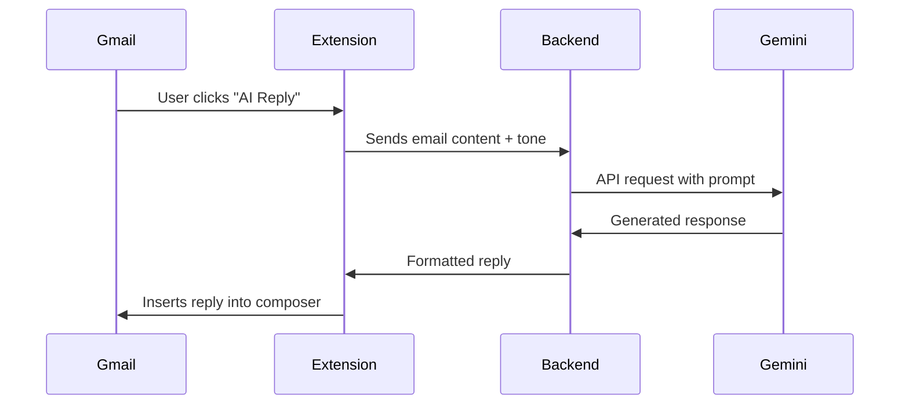

# 📬 AI Smart Email Assistant

### Effortlessly generate professional email replies using Gemini AI – right inside Gmail or through web interface.

---

## 🔍 Overview

AI Smart Email Assistant is a solution that enhances email productivity through AI-powered reply generation. The system features:

- Spring Boot backend with Gemini API integration
- React-based web application
- Chrome extension for seamless Gmail integration
- Tone customization (professional, casual, friendly)
- Real-time response generation

The project helps users quickly craft context-aware email responses while providing a portfolio-worthy example of Spring Boot API consumption across different platforms.

---

## 🚀 Live Demo

- 🌐 **Web Application**: [ai-smart-email-assistant.netlify.app](https://ai-smart-email-assistant.netlify.app)
- 🧩 **Chrome Extension**: [Download from Chrome Web Store](#) _(coming soon)_

---

## ✨ Key Features

| Feature                      | Description                                                    |
| ---------------------------- | -------------------------------------------------------------- |
| **🧠 AI-Powered Replies**    | Generate context-aware email responses using Google Gemini     |
| **🎚️ Tone Customization**    | Choose reply style (professional, casual, friendly, sarcastic) |
| **📋 Clipboard Integration** | One-click copy of generated responses                          |
| **🖥️ Web Application**       | Browser-based interface for email generation                   |
| **🔌 Chrome Extension**      | Direct Gmail integration with injected "AI Reply" button       |
| **⏱️ Real-time Processing**  | Fast response generation from Spring Boot backend              |
| **🚫 CORS Handling**         | Properly configured for cross-origin API access                |

---

## 🛠 Tech Stack

### Backend

`Spring Boot 3.x` · `Java 17` · `Spring Web` · `Spring WebFlux` · `Lombok` · `Gemini API` · `Maven`

### Frontend

`React` · `Vite` · `Material UI` · `Axios`

### Chrome Extension

`Manifest V3` · `Content Scripts` · `Gmail DOM API` · `Chrome Storage`

### Deployment

`Docker` · `Render` (Backend) · `Netlify` (Frontend)

---

## 🖼️ Screenshots

### Web Application UI


### AI Email Reply Generation


### Chrome Extension in Gmail


---

## 🧩 Chrome Extension Workflow



---

## 🚀 Getting Started

### Backend Setup

Get your Gemini API key from Google AI Studio

Clone the repository:

```bash
git clone https://github.com/haiderali077/AI-Email-Assistant
```

Create a `.env` file with the following:

```env
GEMINI_API_KEY=your_api_key
GEMINI_API_URL="https://..."
```

Start the backend:

```bash
./mvnw spring-boot:run
```

---

## 🧩 Chrome Extension Installation

1. Go to `chrome://extensions`
2. Enable **Developer mode**
3. Click **Load unpacked** and select `/extension` folder
4. Pin extension in Chrome toolbar
5. Open Gmail and click Compose. You'll see the `AI Reply` and `Select Tone` buttons integrated directly into the email composer.

---

# 💻 Frontend Setup

To run the React frontend locally:

1. Navigate to the frontend directory:

```bash
cd frontend
```

2. Install dependencies:

```bash
npm install
```

3. Create a `.env` file in the frontend directory with the following content:

```env
VITE_API_URL=http://localhost:8080
```

4. Start the development server:

```bash
npm run dev
```

The frontend will be available at `http://localhost:5173` (default Vite port).

## 📚 Learning Resources

- [Google Gemini API Documentation](https://ai.google.dev/)
- [Chrome Extension Developer Guide](https://developer.chrome.com/docs/extensions/)
- [Spring AI Documentation](https://docs.spring.io/spring-ai/reference/)

---

## 📄 License

Distributed under the MIT License. See `LICENSE` for more information.
